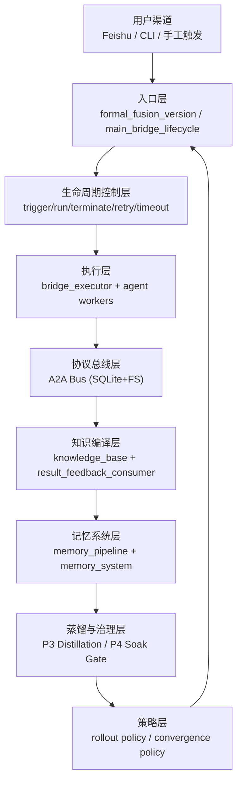
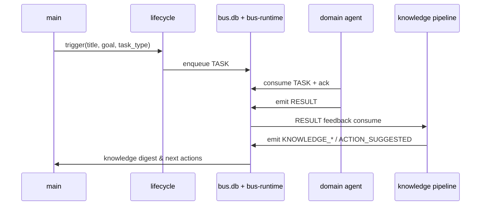
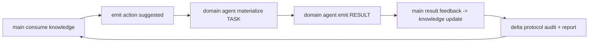
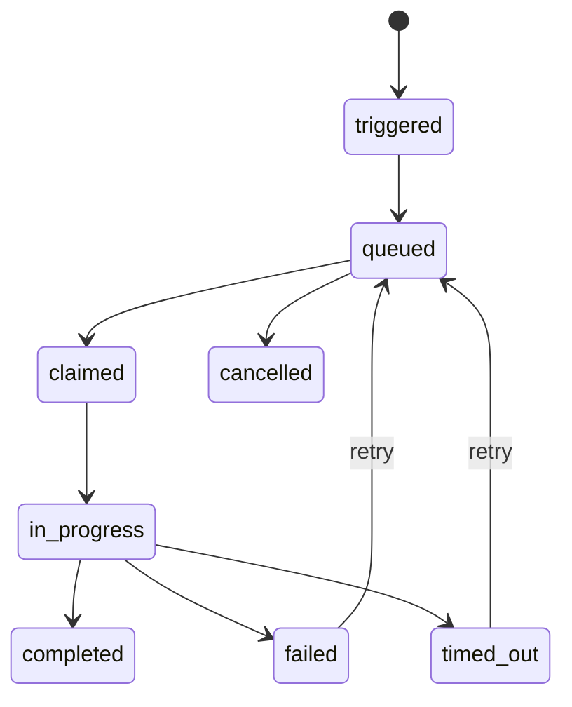

# QYclaw 技术架构白皮书（v1.2-对外发布版）

- 文档版本：`v1.2-public`
- 系统代号：`QYclaw`
- 本项目基于openclaw魔改。
- 编写日期：`2026-05-04`
- 适用范围：多 Agent 协同、知识记忆驱动、可治理可观测的企业级 Agent 操作系统
- 说明：本版本为对外交流与论文/分享用途，已脱敏并移除内部运维细节。

---

## 目录

1. 架构定位与设计目标
2. 系统总架构与适用平台
3. 目录与代码分层
4. 与原始 QYclaw 的对比（QYclaw 增强矩阵）
5. Agent 系统与多 Agent 通讯架构
6. 记忆与知识体系
7. 记忆与知识蒸馏与迭代机制
8. 模型接入架构
9. 任务处理模式与钩子机制
10. CLI 管理体系
11. Skill 管理体系
12. 文档体系与治理规范
13. 发行版本建议与后续演进路线
14. 架构术语表（Glossary）
15. 文档版本信息

---
## 1. 架构定位与设计目标

QYclaw 的目标不是“再做一个聊天机器人”，而是把 Agent 系统从“会话驱动”升级为“操作系统驱动”。

核心目标：

- 多 Agent 协作可治理：每个任务可追踪、可终止、可重试、可审计。
- 知识与记忆可演化：不仅存储历史，还能形成结构化判断资产并反哺决策。
- 通信协议标准化：用内部 A2A 协议替代隐式文本协作。
- 运行可观测：每轮动作有状态、有日志、有门禁、有放行策略。
- 面向发行：支持单机部署、可迁移目录结构、可配置模型与渠道。

---

## 2. 系统总架构与适用平台

### 2.1 总体架构图



### 2.2 运行视图（控制面与数据面）

- 控制面（Control Plane）：入口、生命周期、调度策略、健康门禁、放行门禁。
- 数据面（Data Plane）：`task-board.db`、`bus.db`、`bus-runtime`、知识页、记忆分层、审计日志。

### 2.3 适用平台

- 操作系统：macOS（当前主验证平台）、Linux（目录结构兼容）。
- 运行时：Python 3、SQLite、Shell（zsh/bash 兼容）。
- 接入渠道：Feishu 多账号绑定、CLI 触发、维护脚本定时调度。
- 部署形态：单机多 workspace（`main/dev/content/ops/law/finance/research`）。

---

## 3. 目录与代码分层

### 3.1 顶层目录抽象

建议以 `${QYCLAW_HOME}` 表示安装根目录（默认示例：`${QYCLAW_HOME}`）。

```text
${QYCLAW_HOME}
├─ qyclaw.json                     # 系统主配置
├─ logs/                             # 运行与维护日志
├─ cron/                             # 定时任务状态
├─ memory/                           # 全局会话/记忆运行态
└─ workspace/                        # 工程主目录
   ├─ scripts/                       # 生产脚本入口（P1~P4、运维、桥接）
   ├─ integration/qy_code/       # 融合内核（协议/总线/生命周期）
   ├─ knowledge/                     # 统一知识主根
   ├─ memory/                        # 分层记忆主根
   ├─ memory-system/                 # 记忆系统规则与路由
   ├─ agents/                        # 角色化 agent 资产
   ├─ skills/                        # skill 体系
   └─ QYclaw-MultiAgent-Runbook.md # 运行手册
```

### 3.2 核心子系统目录

```text
workspace/integration/qy_code/
├─ live-link/scripts/                # 生命周期与执行主链
├─ bus/scripts/                      # bus_cli（send/ack/retry/blackboard）
├─ protocols/scripts/                # validate_qyclaw_a2a
├─ control/scripts/                  # coordinator_cli
└─ runtime/live/                     # 线上运行态（DB+报告+队列）
```

### 3.3 关键生产入口（当前版本）

- 正式融合入口：`${QYCLAW_HOME}/workspace/scripts/formal_fusion_version.py`
- 生命周期入口：`${QYCLAW_HOME}/workspace/integration/qy_code/live-link/scripts/main_bridge_lifecycle.py`
- 总线入口：`${QYCLAW_HOME}/workspace/integration/qy_code/bus/scripts/bus_cli.py`
- 协议校验器：`${QYCLAW_HOME}/workspace/integration/qy_code/protocols/scripts/validate_qyclaw_a2a.py`
- 维护总入口：`${QYCLAW_HOME}/workspace/scripts/scheduled_maintenance.sh`

---

## 4. 与原始 QYclaw 的对比（QYclaw 增强矩阵）

> 说明：这里的“原始 QYclaw”是指以会话响应与渠道路由为主的基础形态；QYclaw 是在其上叠加协议化协作、生命周期治理与蒸馏闭环的增强线。

| 维度 | 原始 QYclaw（基线） | QYclaw（当前） | 架构价值 |
| --- | --- | --- | --- |
| 协作方式 | 会话内隐式协作 | A2A 协议 + TaskBoard + Bus | 协作可审计、可回放 |
| 状态管理 | 以消息上下文为主 | 显式任务状态机（trigger/run/retry/terminate） | 故障可恢复 |
| 多 Agent 通讯 | 渠道分流为主 | 内部总线（inbox/outbox/ack/retry/dead-letter） | 异步解耦 |
| 知识沉淀 | 文本记录为主 | 统一知识主根 + 候选评审 + 收敛策略 | 知识可运营 |
| 记忆机制 | 会话记忆主导 | 分层记忆（working/episodic/semantic/procedure/structured） | 长期稳定性提升 |
| 运行治理 | 人工观察 | P1健康门禁 + P1治理 + P2一致性审计 + P3闭环 + P4放行 | 发行级可控 |
| 失败处理 | 依赖人工处理 | retry/timeout-scan/terminate/hold gate | 降低停机风险 |
| 模型策略 | 单模型倾向 | primary + fallback + reasoning能力分层 | 可用性更高 |
| 发行准备 | 脚本集合 | 架构分层+手册+定时+报告目录规范 | 可标准化交付 |

---

## 5. Agent 系统与多 Agent 通讯架构

### 5.1 Agent 拓扑

当前运行拓扑：

- 主控：`main`（协调、汇总、收口）
- 专业 Agent：`dev/content/ops/law/finance/research`

路由策略（配置层）：

- 渠道路由：`bindings`（按 `channel + accountId` 绑定 agent）
- 任务路由：`task_type + policy + knowledge action routes`

### 5.2 通讯架构（A2A）



### 5.3 消息类型（核心）

- 协作消息：`TASK`、`RESULT`、`REVIEW`、`CONSULT`、`EVENT`、`ESCALATE`
- 权限消息：`PERMISSION_REQUEST`、`PERMISSION_RESPONSE`
- 知识生命周期：`KNOWLEDGE_PAGE_UPDATED`、`KNOWLEDGE_CANDIDATE_CREATED`、`MEMORY_CANDIDATE_PROMOTED`、`PROCEDURE_PROMOTED`、`REVIEW_DECISION_RECORDED`、`KNOWLEDGE_ACTION_SUGGESTED`

### 5.4 总线机制

- 存储：SQLite + 文件系统目录（轻量可迁移）。
- 语义：`queued -> acked / retry_wait / dead_letter`。
- 保障：重试、死信、审计、blackboard task 上下文共享。
- 强校验：默认 `QYCLAW_A2A_STRICT_SCHEMA=1`。

---

## 6. 记忆与知识体系

### 6.1 记忆分层（Memory Layer）

目录分层：

- `00-inbox`：原始输入缓存
- `01-working`：进行中任务工作记忆
- `10-episodic`：按日事件序列
- `20-semantic`：语义化稳定知识
- `30-procedures`：可复用操作规程
- `40-structured`：结构化事实/指标
- `90-archive`：冷存档

核心处理流：`capture -> extract -> maintain -> search -> recommend`

### 6.2 统一知识主根（Knowledge Layer）

`workspace/knowledge` 作为统一知识系统，包含：

- `sources`：来源编译页
- `entities / concepts / projects`：主题组织层
- `comparisons / contradictions / open-questions`：决策分析层
- `schemas`：类型约束与模板
- `compiler`：中间产物

### 6.3 记忆与知识关系

- 记忆负责“经验沉淀与检索效率”。
- 知识负责“可共享事实与可治理判断资产”。
- 两者通过候选与评审流程打通，而不是简单文件互拷。

---

## 7. 记忆与知识蒸馏与迭代机制

### 7.1 P3 蒸馏流水线（闭环）



实现入口：

- `${QYCLAW_HOME}/workspace/scripts/p3_distillation_pipeline.py`

### 7.2 收敛策略

- 通过 `knowledge-convergence-policy.v1.json` 控制自动扩圈深度。
- 二轮后可进入 `human_review_only`，强制人工收口。
- 自动生成 convergence 报告供运维与审阅。

### 7.3 P4 放行门禁（迭代治理）

- 对最近窗口进行稳定性评估（health/p3/executor/告警）。
- 结论 `approve` 或 `defer`。
- `defer` 触发 hold flag（自动延期放量），但不再当作系统故障。

实现入口：

- `${QYCLAW_HOME}/workspace/scripts/p4_soak_release_gate.py`

---

## 8. 模型接入架构

### 8.1 Provider 抽象

模型配置位于 `qyclaw.json -> models.providers`，当前实现为 OpenAI-compatible provider 抽象：

- provider 维度：`baseUrl`、`api`、`models[]`
- model 维度：`id`、`reasoning`、`contextWindow`、`maxTokens`

### 8.2 主备模型策略

在 `qyclaw.json -> agents.defaults.model`：

- `primary`：主模型
- `fallbacks[]`：故障/拒绝时降级链

### 8.3 记忆检索模型

在 `agents.defaults.memorySearch`：

- 可独立于主对话模型（例如本地 embedding 服务）
- 支持 `onSessionStart`、`onSearch` 同步策略

### 8.4 工程建议

- 将“推理模型”和“高吞吐模型”分层，避免单一模型承担所有负载。
- 对外部模型切换保留 failback，以降低平台波动对主链影响。

---

## 9. 任务处理模式与钩子机制

### 9.1 生命周期状态机



### 9.2 执行模式

- 同步触发：`trigger + run` 同步推进。
- 异步调度：`bridge-runner` 定时消费子任务。
- 强制干预：`terminate(scope=single/tree)`、`retry`、`timeout-scan`。

### 9.3 钩子机制

钩子分为两类：

- 平台内置钩子：`qyclaw.json -> hooks.internal`（当前启用 `session-memory`）。
- 维护链钩子：由 `scheduled_maintenance.sh` 编排的治理脚本链（P1/P2/P3/P4）。

---

## 10. CLI 管理体系

### 10.1 操作入口

- 统一生产入口：`formal_fusion_version.py`
- 生命周期入口：`main_bridge_lifecycle.py`
- 维护入口：`scheduled_maintenance.sh`

### 10.2 常用命令族

| 领域 | 命令入口 | 说明 |
| --- | --- | --- |
| 融合运行 | `formal_fusion_version.py run/status/smoke` | 生产任务入口 |
| 生命周期 | `main_bridge_lifecycle.py trigger/run/status/retry/terminate/timeout-scan` | 任务治理核心 |
| P3 | `p3_distillation_pipeline.py run/status` | 知识-记忆闭环 |
| P4 | `p4_soak_release_gate.py run/status` | 放行门禁 |
| 健康/治理 | `lifecycle_health_gate.py` / `lifecycle_p1_governance.py` | 稳定性保障 |

### 10.3 定时任务管理

- 安装脚本：`setup_memory_maintenance_cron.sh`
- 调度机制：launchd jobs（memory / knowledge / fusion / bridge / p1 / p3 / p4）

---

## 11. Skill 管理体系

### 11.1 目录与作用域

- 全局技能仓：`workspace/skills`
- Agent 专用技能：`agents/<agent-id>/agent` 下引用
- 运行时桥接：`opencli_router.py` + `opencli_guard.py` + `opencli_nl2cmd.py`

### 11.2 管理原则

- 能力注册优先于 prompt 内硬编码。
- 写操作能力与读操作能力分级治理（guard/risk control）。
- skill 变更应伴随路由与信任规则更新。

### 11.3 自然语言到命令

- NL 指令先做站点/意图识别，再映射到命令模板。
- guard 层负责限流、降级与 fallback 约束。

---

## 13. 文档体系与治理规范

### 13.1 文档分层

- 架构主文档：本白皮书（跨项目抽象层）。
- 运行手册：`QYclaw-MultiAgent-Runbook.md`（操作层）。
- 阶段文档：`integration/qy_code/live-link/PHASE*.md`（演进层）。
- 策略文档：`knowledge/schemas/*.json`、`live-link/config/*.json`（策略层）。

### 13.2 建议治理规则

- 每次版本升级必须同步更新：架构文档、运行手册、参数速查。
- 变更必须具备：入口、回滚、验证、审计报告路径。
- 发行版不可携带明文密钥，密钥应迁移到密钥管理或环境变量。

---

## 14. 发行版本建议与后续演进路线

### 14.1 当前发行准备度（技术视角）

- 已具备：生命周期治理、协议总线、知识记忆闭环、放行门禁、定时运维。
- 待强化：
  - 配置治理：配置脱敏、密钥外置、权限最小化。
  - 运行稳定：死信自动回收策略、队列水位报警、多节点容灾。
  - 产品化：安装器、环境自检、升级迁移脚本、版本兼容矩阵。

### 14.2 推荐演进路径

1. `v1.1`：发布基线（Secrets 全外置 + 配置模板化）。  
2. `v1.2`：观测增强（统一指标面板、告警分级、SLO）。  
3. `v1.3`：可移植部署（Docker/Compose + one-command bootstrap）。  
4. `v2.0`：多实例协作（远程 worker + control plane API）。

---

## 附录 B：架构术语表（Glossary）

| 术语 | 定义 | 典型实现 |
| --- | --- | --- |
| Control Plane | 负责系统调度、状态推进、策略执行的控制层 | `formal_fusion_version.py` + `main_bridge_lifecycle.py` |
| Data Plane | 承载业务消息、任务数据、知识与记忆数据的运行层 | `bus.db`、`task-board.db`、`knowledge/`、`memory/` |
| A2A Protocol | Agent-to-Agent 内部协作协议，定义 envelope 与 message body schema | `qyclaw-a2a/v1` |
| TaskBoard | 任务台账与状态机的持久化层 | `task-board.db` |
| Bus Runtime | 消息文件队列与审计目录（inbox/outbox/dead-letter） | `runtime/live/bus-runtime/` |
| Blackboard | task 维度共享上下文键值区 | `blackboard_entries` + 文件镜像 |
| Convergence | 自动蒸馏在达到策略阈值后转人工收口的机制 | `knowledge-convergence-policy.v1.json` |
| Distillation | 从消息与结果中提炼结构化候选、规则、知识页的过程 | `p3_distillation_pipeline.py` |
| Soak Gate | 连续稳定观察窗口下的放行判定机制 | `p4_soak_release_gate.py` |
| Hold Flag | 放量延期标记，阻止进入扩量阶段 | `defer-rollout.hold` |

---

## 附录 E：文档版本信息

- `v1.0`：建立完整技术架构主干（目录、分层、对比、流程、参数、发行建议）
- `v1.1`：新增术语表、接口契约、Go/No-Go 发行清单（本附录）


## 附录 I：版本信息（v1.2）
- 在 v1.1 基础上新增生产化三件套：
  - 部署运行手册（附录 F）
  - 回滚预案（附录 G）
  - 监控与告警基线（附录 H）
- 用途：支持“可上线、可观测、可回滚”的正式发布要求。
